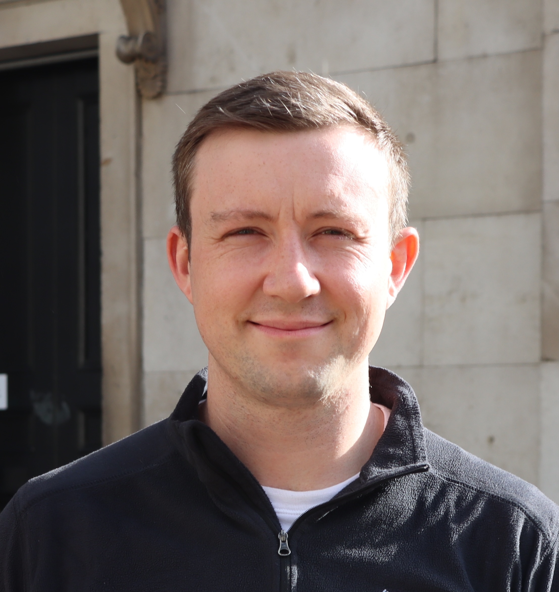
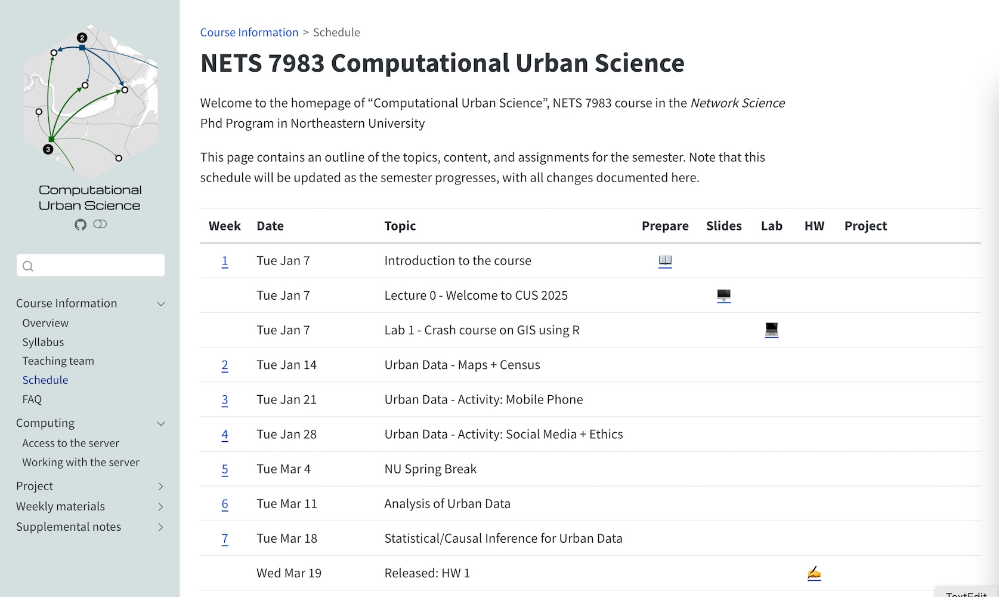

## NETS 7983 Computational Urban Science

Welcome!

This course introduces the field of **Computational Urban Science**, focusing on methods to collect and analyze urban data. Covers techniques such as Geographic Information Systems, network science, machine learning, spatial models, and causal inference to examine city dynamics and inform urban planning, policy, and research. Explores the application of these methods to real-world urban datasets, including mobile phone data, social media, and transactional data, enabling critical insights into the complexities of urban systems.


## NETS 7983 Computational Urban Science

Learning objectives:

- **Collect and Analyze Urban Data**: (spatial models, spatial visualization, network science) + (`R` and `python`) + (visualization).
- **Use Computational Social Science tools for urban insights**: (machine learning) + (spatial analysis) + (causal inference) = urban insights.
- **Understand Urban Dynamics**: analyze complex urban phenomena  (mobility patterns, social urban networks, lifestyle patterns, urban decision-making) to inform urban policy and planning.
- **Develop urban data solutions** design and implement data-driven solutions for (sustainability, transportation, epidemics, resilience) by creating (models and simulations).
- **Design and evaluate urban interventions** use causal inference methods to evaluate interventions and policies
- **Collaborate and communicate urban insights** create decision-making tools.

## Meet the instructors

::: columns
::: {.column width="40%"}
{fig-alt="Headshot of Prof. Esteban Moro" fig-align="left" width="200"}
:::

::: {.column width="60%"}
-   Full Professor in Physics, Department of Physics & Network Science Institute, Northeastern University.
-   Affiliated Researcher at MIT Media Lab
-   Find out more at [estebanmoro.org](https://estebanmoro.org)
:::
:::

::: columns
::: {.column width="40%"}
{fig-alt="Headshot of Dr. Hamish Gibbs" fig-align="left" width="200"}
:::

::: {.column width="60%"}
-   Postdoctoral Researcher at Network Science Institute, Northeastern University.
-   Find out more at [hamishgibbs.net](https://hamishgibbs.net)
:::
:::

## Meet each other


{fig-alt="Red sticker with overlaid text \"Hello, my name is...\"" fig-align="center" width="300px"}


- What is your experience with Computational Social Science, Network Science, and Urban Science?
- What do you hope to get out of this course?


::: {.cell}
::: {.cell-output-display}


```{=html}
<div class="countdown" id="timer_98563421" data-update-every="1" tabindex="0" style="right:0;bottom:0;">
<div class="countdown-controls"><button class="countdown-bump-down">&minus;</button><button class="countdown-bump-up">&plus;</button></div>
<code class="countdown-time"><span class="countdown-digits minutes">08</span><span class="countdown-digits colon">:</span><span class="countdown-digits seconds">00</span></code>
</div>
```


:::
:::


## Communication

We will use:

-   **Canvas** for official announcements and private communications.
-    **Slack** for daily information, Q&A, team discussions, can casual conversations.<p>
  <https://netsi-cus-course.slack.com><p>
  Join using the following link: <p>
  <https://join.slack.com/t/netsi-cus-course/signup><p>
  Any one with a northeastern email address can join.

-  **email** Send an email to the instructors. Only if needed. Please use Slack for anything related to the course.


## Classes

- **Tuesdays 3pm-6:30pm** at Room 207 of the [Network Science Institute](https://www.google.com/maps/place/177+Huntington+Ave,+Boston,+MA+02115/@42.3448889,-71.0827252,17z/data=!3m1!4b1!4m6!3m5!1s0x89e37a1054078855:0x986037402dd781ff!8m2!3d42.3448889!4d-71.0827252!16s%2Fg%2F12lv76y67!5m1!1e4?entry=ttu&g_ep=EgoyMDI0MTIxMS4wIKXMDSoASAFQAw%3D%3D)
- Address: 177 Huntington Ave, Boston, 2nd floor


```{=html}
<iframe src="https://www.google.com/maps/embed?pb=!1m18!1m12!1m3!1d2948.8890450383274!2d-71.0827252!3d42.3448889!2m3!1f0!2f0!3f0!3m2!1i1024!2i768!4f13.1!3m3!1m2!1s0x89e37a1054078855%3A0x986037402dd781ff!2s177%20Huntington%20Ave%2C%20Boston%2C%20MA%2002115!5e0!3m2!1sen!2sus!4v1735827384969!5m2!1sen!2sus" width="800" height="450" style="border:0;" allowfullscreen="" loading="lazy" referrerpolicy="no-referrer-when-downgrade"></iframe>
```


## Material

- All course material will be available at the webpage [socialurban.net/CUS](socialurban.net/CUS)
- This is the first edition of this course. Help us build/edit/expand it!



## Computing

We are going to use our SUNLab sever `stella.northeastern.edu` for data access and computing:

- **Apply for an account:** request an account on the server to the instructors 
- **User login and password:** You will be assigned a unique user login and password to access the server.
- **More information**: [socialurban.net/CUS > Computing](https://www.socialurban.net/CUS/computing-access.html)
- **Rules**: Check the [rules to access and use the server](https://www.socialurban.net/CUS/computing-access.html#rules-of-access-and-use-of-the-course-server)<p><br>

- **Working on the server**. You can use RStudio, VSCode, or Jupyter Notebooks to work on the server.

- **Datasets**. All datasets used in the labs and materials can be found in /data/CUS

## Grading

Grading in this course will be as follows.

Attendance and Participation: 20%. Homework assignments: 20% each. Final project: 40%.

| **Category**                 | **Percentage** |
|------------------------------|----------------|
| Attendance and Participation | 20%            |
| Homework assignments.        | 20% each       |
| Final project                | 40%            |

Homework assignments will be individual. Final project can be in groups of up to 2 persons.

